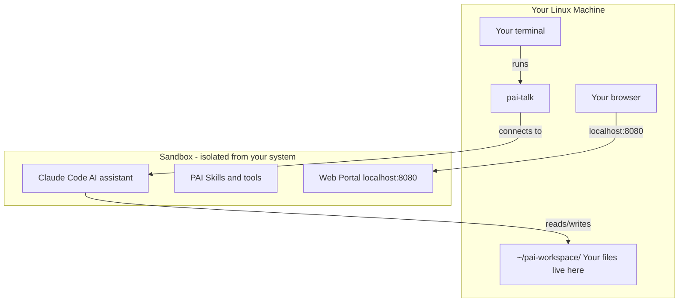

# PAI-Incus — Your Own AI Assistant on Linux

A sandboxed AI workspace running Claude Code on your Linux machine. One command to install, one command to start talking to your AI.

## How It Works



**The key idea:** Your AI runs inside a sandbox (a mini computer inside your computer). It can read and write files in `~/pai-workspace/`, but it can't touch anything else on your machine. You can destroy and recreate the sandbox without losing your files.

## What You Need

- Linux (Ubuntu 22.04+, Debian 12+, or Fedora 38+)
- An [Anthropic account](https://console.anthropic.com/) (free to create)
- About 10 minutes for the first install

## Quick Start

### Step 1: Install

Open your terminal and paste this:

```bash
command -v git >/dev/null || { sudo dnf install -y git-core 2>/dev/null || sudo apt-get install -y git 2>/dev/null; }
git clone https://github.com/jaredstanko/pai-incus.git
cd pai-incus
./install.sh
```

The first line installs `git` if you don't have it yet. The installer handles everything else automatically. You'll see a lot of output scrolling by -- **ignore it all** until you see the final instructions.

> **"Group membership" message?** If the installer says to log out and back in, do that, then come back to the `pai-incus` folder and run `./install.sh` again. It will pick up where it left off.

### Step 2: Open a PAI Session

Open a **new terminal window** (or run `source ~/.bashrc` in the current one), then run:

```bash
pai-talk
```

### Step 3: Sign In

Claude Code will ask you to sign in. It opens a browser -- log in with your Anthropic account. A free account works.

When it asks "Do you trust /home/claude/.claude?" say **yes**.

### Step 4: Set Up the Web Portal

Once you're signed in, paste this message into your PAI session:

```
Install PAI Companion following ~/pai-companion/companion/INSTALL.md.
Skip Docker (use Bun directly for the portal) and skip the voice
module. Keep ~/.vm-ip set to localhost and VM_IP=localhost in .env.
After installation, verify the portal is running at localhost:8080
and verify the voice server can successfully generate and play audio
end-to-end (not just that the process is listening). Fix any
macOS-specific binaries (like afplay) that won't work on Linux.
Set both to start on boot.
```

**Claude Code will ask you some questions. Each time press 2 (Yes) to allow it to edit settings for this session.**

Wait for it to finish. This takes a few minutes.

### Step 5: You're Done

Open http://localhost:8080 in your browser to see the web portal. From now on, just run `pai-talk` whenever you want to talk to your AI.

---

## What You Get

- **Sandboxed AI** -- Claude Code runs inside an isolated container, not directly on your system
- **System tray icon** -- start sessions, stop the sandbox, open the web portal from one icon (optional, offered during install)
- **GNOME search** -- on GNOME, type "pai" in Activities to see PAI actions
- **Web portal** -- a local website for viewing AI-created content and exchanging files
- **Session resume** -- pick up previous conversations where you left off
- **Shared folders** -- `~/pai-workspace/` on your machine is shared with the AI
- **Audio** -- the AI can speak through your speakers (the installer sets up PipeWire automatically)

## Commands

| Command | What it does |
|---------|-------------|
| `pai-talk` | Talk to your AI |
| `pai-talk --resume` | Pick up a previous conversation |
| `pai-start` | Start the sandbox (it auto-starts when you run pai-talk) |
| `pai-stop` | Stop the sandbox to free up resources |
| `pai-status` | Check if everything is running and healthy |
| `pai-shell` | Open a plain terminal inside the sandbox (no AI) |

## Shared Files

Your files live on your machine in `~/pai-workspace/`. The AI can see them too:

```
~/pai-workspace/
  exchange/    Drop files here -- the AI can read them
  work/        AI projects and output
  data/        Datasets and databases
  portal/      Web portal content
  claude-home/ AI settings, memory, sessions
  upstream/    Reference repos
```

Your data stays on your machine. You can destroy and recreate the sandbox without losing anything.

## Troubleshooting

**Install fails partway through** -- Just run `./install.sh` again. It's safe to re-run and will pick up where it left off.

**"pai-talk" not found** -- Open a new terminal window, or run `source ~/.bashrc` in the current one.

**"Group membership" error** -- Log out of your computer and log back in, then run `./install.sh` again.

**Web portal not loading** -- Make sure the sandbox is running (`pai-status`), then try http://localhost:8080.

**No audio** -- The installer sets up PipeWire automatically. If it's still not working, check that the PipeWire service is running: `systemctl --user status pipewire`.

**Something else broke** -- Run `./scripts/verify.sh` to see what's working and what's not. Check the install log in the `pai-incus/` folder (named `pai-install-<timestamp>.log`). If you're stuck, [open an issue](https://github.com/jaredstanko/pai-incus/issues).

---

## Advanced

Everything below is for power users who want to customize or troubleshoot in depth.

### Install Options

```bash
./install.sh                        # Normal install
./install.sh --verbose              # Show detailed output
./install.sh --name=v2              # Parallel install as a separate instance
./install.sh --name=v2 --port=8082  # Parallel install with a specific portal port
```

### Parallel Instances

Use `--name` to run multiple instances side by side. Each gets its own container, workspace, and profile:

```bash
# Install a second instance for testing
./install.sh --name=v2

# Everything is isolated:
#   Container: pai-v2
#   Workspace: ~/pai-workspace-v2/
#   Profile:   pai-v2
#   Portal:    http://localhost:8081 (default for named instances)
```

All commands accept `--name` to target a specific instance:

```bash
pai-talk --name=v2
pai-status --name=v2
./scripts/upgrade.sh --name=v2
./scripts/uninstall.sh --name=v2
./scripts/backup-restore.sh backup --name=v2
```

### Upgrading

```bash
cd pai-incus
git pull
./scripts/upgrade.sh
```

Your workspace, authentication, and sessions are preserved.

### Backup & Restore

```bash
./scripts/backup-restore.sh backup     # Back up the sandbox + workspace
./scripts/backup-restore.sh restore    # Restore from a backup
```

### Uninstall

```bash
./scripts/uninstall.sh
```

Removes the sandbox container, Incus profile, storage pool, network bridge, CLI commands, PATH block, and subuid entries. Asks before deleting workspace data. Does not remove the Incus package itself or PipeWire.

### Versions

Tools (Bun, Claude Code, Playwright) install at their latest versions. Only the Node.js major version (22 LTS) and container image (Ubuntu 24.04) are pinned. Run `./scripts/verify.sh` to check the full system state.

### Security Model

The container runs **unprivileged** with:
- **User namespaces** -- container root is not host root
- **AppArmor** -- auto-generated per-container profile
- **Seccomp** -- allowlist of ~300 safe syscalls
- **Controlled mounts** -- only 6 specific directories shared
- **Resource limits** -- 4 CPU, 4GB RAM, 50GB disk

### Why Incus?

| Feature | Incus | Docker | systemd-nspawn |
|---------|-------|--------|----------------|
| Isolation defaults | Strong (unprivileged + AppArmor + seccomp) | Weak | Weak without hardening |
| systemd as PID 1 | Native | Fights it | Native |
| Snapshots/rollback | Built-in | None | Manual (btrfs only) |
| Audio passthrough | Declarative proxy | Manual mounts | Manual mounts |
| Dependencies | One package | One package | Built-in |

### Comparison with pai-lima (macOS)

| | pai-lima (macOS) | pai-incus |
|---|---|---|
| Isolation | Lima VM (Apple Virtualization.framework) | Incus container (namespaces + seccomp + AppArmor) |
| Audio | VirtIO sound device | PipeWire socket passthrough |
| Terminal | kitty (bundled) | Any terminal |
| Status UI | Swift menu bar app | CLI (`pai-status`) |
| Install | `brew install lima kitty` + VM provision | `dnf install incus` / `apt install incus` + container provision |
| Architecture | macOS + Apple Silicon only | Linux x86_64 + aarch64 |
